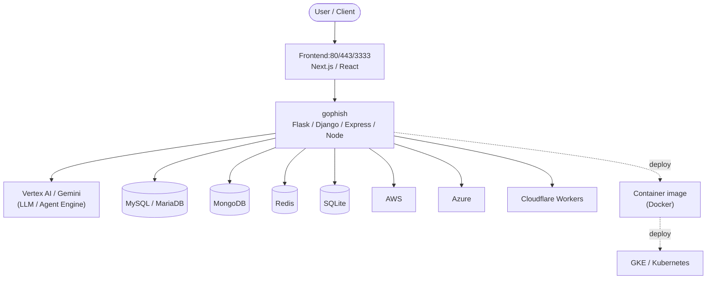

# Context Map — `gophish`

> Auto-generated architecture & deployment context map. Summarizes the core application, container/cloud footprint, and database connections. Regenerate after significant structural changes.

**Repo:** `avnit/gophish` · **Fork** · Public · Primary language: Go · Default branch: `master` · Files: 486

**Description:** Open-Source Phishing Toolkit

## 1. Core application

Gophish: Open-Source Phishing Toolkit

- **Frameworks / runtime:** Flask, Django, Express / Node, Next.js, React
- **Listens on port(s):** 80, 443, 3333, 22, 25, 1639

## 2. Containers & cloud applications

**Containers:**
- `Dockerfile`

**Detected cloud platforms / services:** Vertex AI / Gemini (GCP), GKE / Kubernetes, AWS, Azure, Cloudflare Workers, Ansible, Vercel

## 3. Database connections

**Datastores in use:** MySQL / MariaDB, MongoDB, Redis, SQLite, Cassandra, Vector DB (Chroma/Pinecone/pgvector/FAISS)

**Referenced in:**
- `ansible-playbook/roles/gophish/files/config.json`
- `config.json`
- `config/config_test.go`
- `controllers/api/api_test.go`
- `controllers/controllers_test.go`
- `db/db_sqlite3/dbconf.yml`
- `middleware/middleware_test.go`
- `models/models.go`
- `models/models_test.go`
- `static/js/dist/app/passwords.min.js`

## 4. Architecture diagram

## 5. Security posture

- **Static scan findings:** 2 high, 2 medium

| Severity | Rule | File:Line |
|---|---|---|
| high | tls-verify-disabled | `controllers/api/import.go:121` |
| high | generic-secret-assign | `controllers/api/user_test.go:69` |
| medium | cors-wildcard-creds | `controllers/phish.go:169` |
| medium | cors-wildcard-creds | `middleware/middleware.go:78` |

---
_Generated by repo context-mapping pass on 2026-08-13._